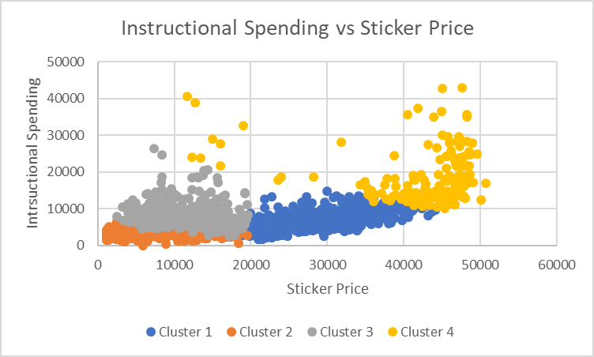
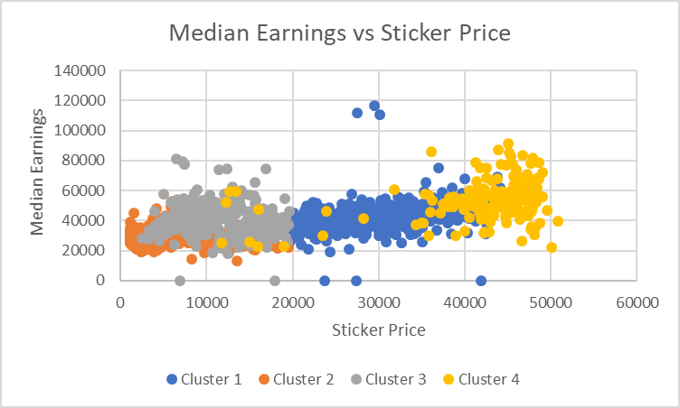
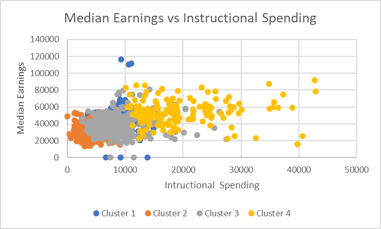

# Which Schools Are Worth The Tuition and Expenditures and Ends With Highest Earnings After Graduation?

What colleges give you the best bang for your buck? So, I used the College Level Characteristics from the IPEDS Database and the College Scorecard data set from Opportunity Insights to find some results. From here, I found three variables I wanted to use - Median Earnings (after graduation), Instructional Expenditures per Student, and Sticker Price (Tuition) - and found the clusters of schools that, mostly, found the results I desired.

I began my analysis with a 5 cluster model and the results appeared quite appropriate. Yet, I wanted to attempt 3 clusters to see if it formulated better results. However, it was wildy undesirable, and I went back to 5 cluster model. I had some interesting clusters and graphs I could use, however there was one issue. I had a cluster of 1. This school was a huge outlier, however I liked my current graph. Thus, I removed the school and continued with the 4 clusters I currently had.

As seen in figure 1, I compared Instructional Spending and Sticker Price. Here, I was able to find what schools made you pay from the least to the most in order to attend their school. Then, I made graphs comparing Median Earnings and Sticker Price (figure 2) and Median Earnings and Instructional Spending (figure 3). I was able to find with these, what schools gave the best results with a higher median income.

Ultimately, I came to these results: Cluster 4 has higher instructional expenditures and tuition, but does have higher median earnings, Cluster 1 has average instructional expenditures and median earnings, but a higher tuition, Cluster 3 has average median earnings and instructional expenditures, but a lower tuition, and Cluster 2 has lower instructional expenditures, sticker price, and median earnings.

Thus, using my analysis I can make suggestions for those in either different income brackets or those wanting to see which colleges are worth their money in the long run. Ultimately, Cluster 3 and Cluster 4 are the two most worth the time and effort. If one has a wealthy family or financial aid, the schools in Cluster 4 have the best results for median earnings after graduation. However, won't be receiving financial aid and doesn't have a wealthy family, schools in Cluster 3 make the most sense. Cluster 3 has around the same results for median earnings as Cluster 2 does for significantly less tuition cost. However, schools in Cluster 1 are the most affordable and can still have decent results.

 

(Figure 1 - Cluster Model Graph for Spending vs Tuition)

 

(Figure 2 - Cluster Model Graph for Median Earnings vs Tuition)

 

(Figure 3 - Cluster Model Graph for Median Earnings vs Spending)

[My Data Spreadsheet](Data.xlsx)
[Opportunity Insights Data Sets](https://opportunityinsights.org/data/?geographic_level=100&topic=105&paper_id=0#resource-listing)
